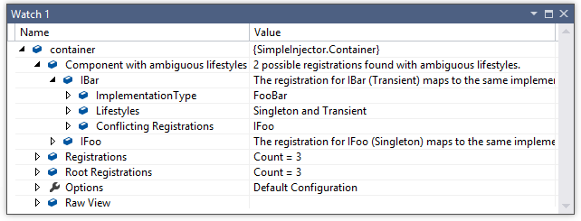

.. _ambiguouslifestyles:

=========================================
Diagnostic Warning - Ambiguous Lifestyles
=========================================

Severity
========

Warning

Cause
=====

Multiple registrations with the different lifestyles map to the same component.

Warning Description
===================

When multiple registrations with a different lifestyle map to the same component, the component is said to have ambiguous lifestyles. Having one single component with multiple lifestyles will cause instances of that component to be cached in different ways and this can lead to behavior that you might not expect.

For instance, having a single component that is registered both as Singleton and as Transient hardly ever makes sense, because the singleton registration implies that it is thread-safe, while the transient registration means that it, or one of its dependencies, is not thread-safe and should not be reused. One of the registrations of this component will likely be wrong.

How to Fix Violations
=====================

Make all registrations with the same lifestyle.

In case you really intended to have this single component to be registered with two different lifestyles, this is a clear indication that the component should actually be split into multiple smaller components, each with their specific lifestyle.

When to Ignore Warnings
=======================

Do not ignore these warnings. False positives for this warning are rare and even when they occur, the registration or the application design can always be changed in a way that the warning disappears.

Example
=======

The following example shows a configuration that will trigger the warning:

.. code-block:: c#

    var container = new Container();

    container.Register<IFoo, FooBar>(Lifestyle.Transient);
    container.Register<IBar, FooBar>(Lifestyle.Singleton);

    container.Verify();

The *FooBar* component is registered once as **Singleton** for *IFoo* and once as **Transient** for *IBar* (assuming that *FooBar* implements both *IFoo* and *IBar*). Below is an image that shows the output for this configuration in a watch window. The watch window shows two mismatches and one of the warnings is unfolded.

The issue can be fixed as follows:

.. code-block:: c#

    var container = new Container();

    container.Register<IFoo, FooBar>(Lifestyle.Singleton);
    container.Register<IBar, FooBar>(Lifestyle.Singleton);
    
    container.Verify();
    
Another way to fix this issue is by splitting *FooBar* into multiple smaller components:

.. code-block:: c#

    var container = new Container();

    // New component with singleton lifestyle
    container.Register<IFooBarCommon, FooBarCommon>(Lifestyle.Singleton);
    
    // Old component split into two, both depending on IFooBarCommon.
    container.Register<IFoo, Foo>(Lifestyle.Transient);
    container.Register<IBar, Bar>(Lifestyle.Singleton);
    
    container.Verify();
   
The following example shows how to query the Diagnostic API for Torn Lifestyles:

.. code-block:: c#

    // using SimpleInjector.Diagnostics;

    var container = /* get verified container */;

    var results = Analyzer.Analyze(container).OfType<AmbiguousLifestylesDiagnosticResult>();
        
    foreach (var result in results)
    {
        Console.WriteLine(result.Description);
        Console.WriteLine("Component name: " + result.ImplementationType.Name);
        Console.WriteLine("Lifestyles of component: " +
            string.Join(", ", result.Lifestyles.Select(l => l.Name)));
        Console.WriteLine("Conflicting registrations: " +
            string.Join(", ", result.ConflictingRegistrations.Select(
                r => r.ServiceType.Name)));
    }
