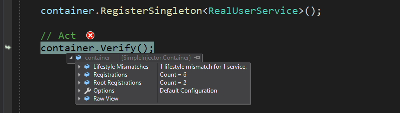
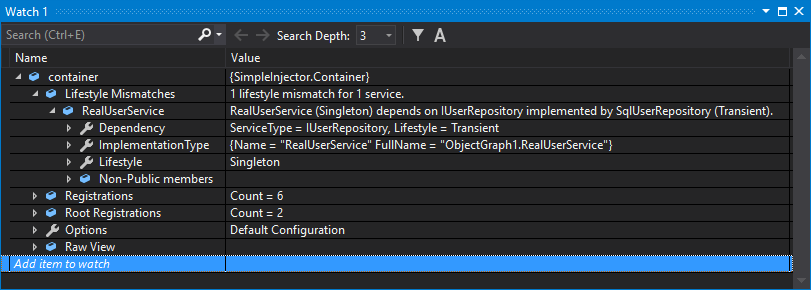
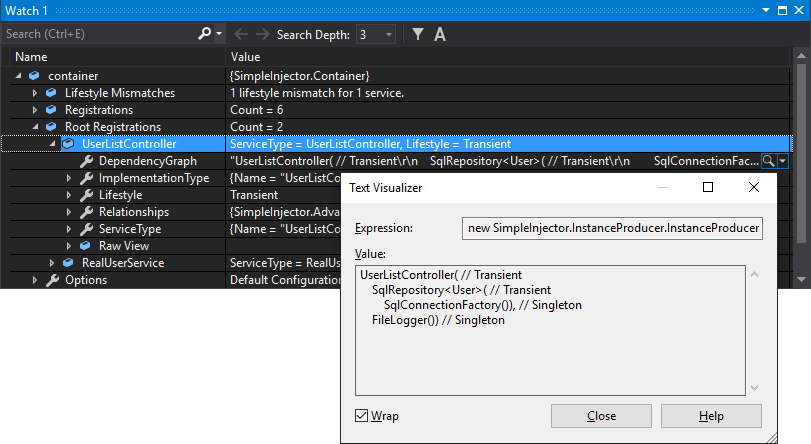

===================
Diagnostic Services
===================

The **Diagnostic Services** allow you to verify, analyze, diagnose, and visualize the container's configuration to search for common configuration mistakes.

Simple Injector knows about several common issues that might arise when composing object graphs, and can expose this information to the developer via its diagnostics API. Simple Injector classifies the issues in two severities: information messages and diagnostic warnings:

* *Information messages* are are hints of things might want to look into, such as possible Single Responsibility Principle violations. Information messages can be requested by supplying your *Container* instance to the **Analyzer.Analyze** method.
* *Diagnostic warnings* on the other hand are strong indications that there is a problem with your configuration. See them as the Simple Injector equivalent of C# warnings: Your code will compile (as in: Simple Injector will be able to resolve your objects), but you rather want to fix the warning or otherwise explicitly suppress it. Like information messages, warnings can be requested by calling **Analyzer.Analyze**. But more conveniently, warnings will be reported in the form of an exception when you call **Container.Verify()**.

This document goes in further detail how to obtain and interpreter these messages.

Supported Diagnostic Warnings
=============================

.. toctree::
    :titlesonly:

    Lifestyle Mismatches <LifestyleMismatches>
    Short Circuited Dependencies <ShortCircuitedDependencies>
    Torn Lifestyle <tornlifestyle>
    Ambiguous Lifestyles <ambiguouslifestyles>
    Disposable Transient Components <disposabletransientcomponent>
    
Supported Information Messages
==============================

.. toctree::
    :titlesonly:

    Potential Single Responsibility Violations <PotentialSingleResponsibilityViolations>
    Container-Registered Types <ContainerRegisteredTypes>

How to view diagnostic results
==============================

When you call **Container.Verify()** at the end of the configuration process, Simple Injector will do two things:

* It runs a simple check on all registrations to see if all components can be created. This is done by calling their constructors and injecting their dependencies. If any registrations are missing, an exception is thrown
* The container checks for diagnostic warnings. If there are any warnings, a exception is thrown that contains a summary of all reported diagnostic warnings.

.. container:: Note

    **Tip**: Always call **Verify()** when you're done configuring the **Container**. This allows your application to fail-fast in case of configuration problems.

There are two ways to view the diagnostic results—results can be viewed visually during debugging in Visual Studio and programmatically by calling the Diagnostic API.

Diagnostic results are available during debugging in Visual Studio after calling **Container.Verify()**. Set a breakpoint after the line that calls **Verify()** and when the breakpoint hits, hover over the **Container** instance with the mouse. The debugger context menu will appear for the *container* variable which you can unfold to view the diagnostic results. This might look like this:

Another option is to add the *container* variable to the Visual Studio Watch window by right clicking on the variable and selecting 'Add Watch' in the context menu:

The Debugger View also allows visualizing your application's dependency graphs. This can give you a good view of what the end result of your DI configuration is. By drilling into the list of *Registrations* or *Root Registrations*, you can select the text visualizer (the magnifying glass icon) on the *DependencyGraph* property on any of the listed registrations:

.. container:: Note

    **Note**: *Root Registrations* are registrations that are not depended upon by any other registration (or at least, not that Simple Injector can statically determine). They form the starting point of an object graph and are usually the types that are directly resolved from the container.

This same information can be requested programmatically by using the Diagnostic API. The Diagnostic API is located in the **SimpleInjector.Diagnostics** namespace. Interacting with the Diagnostic API is especially useful for automated testing. The following is an example of an integration test that checks whether the container is free of configuration warnings and information messages:

.. code-block:: c#

    [TestMethod]
    public void Container_Never_ContainsDiagnosticWarnings()
    {
        // Arrange
        var container = Bootstrapper.GetInitializedContainer();

        container.Verify(VerificationOption.VerifyOnly);

        // Assert
        var results = Analyzer.Analyze(container);

        Assert.IsFalse(results.Any(), Environment.NewLine +
            string.Join(Environment.NewLine,
                from result in results
                select result.Description));
    }

Object graphs can be visualized programmatically as well, by calling the **VisualizeObjectGraph** method on an **InstanceProducer**:

.. code-block:: c#

    InstanceProducer producer = container.GetRegistration(typeof(UserListController));
    
    string graph = producer.VisualizeObjectGraph();

The value returned by **VisualizeObjectGraph** is identical as what would be shown in the **DependencyGraph** property in the debugger:
    
.. code-block:: text

    UserListController( // Transient
        SqlRepository<User>( // Transient
            SqlConnectionFactory()), // Singleton
        FileLogger()) // Singleton

The visualized graph shows a textual representation of the graph with a C#-like syntax. By default, the graph visualized using **VisualizeObjectGraph** contains information about the lifestyle of each component. There is, however, a **VisualizeObjectGraph** overload that allows controlling the visualized graph:

.. code-block:: c#

    InstanceProducer producer = container.GetRegistration(typeof(UserListController));
    
    string graph = producer.VisualizeObjectGraph(new VisualizationOptions
    {
        IncludeLifestyleInformation = false, // true by default
        UseFullyQualifiedTypeNames = false // false by default
    });

In this case the `graph` variable would contain the following information:
    
.. code-block:: text

    UserListController(
        SqlRepository<User>(
            SqlConnectionFactory()),
        FileLogger())

A call to **Container.Verify()** forces the container to fail fast when any diagnostic warning is detected. A call to **Verify()** defaults to **Verify(VerificationOption.VerifyAndDiagnose)**. When called, the container will check for all the warning types, since they are most likely to cause bugs in your application. By calling this overload during application startup, or inside an integration test, you'll keep the feedback cycle as short as possible, and you'll get notified about possible bugs that otherwise might have stayed undetected for much too long.

The diagnostic analysis, however, can also be suppressed by calling **Verify(VerificationOption.VerifyOnly)**. In that case, the container will only perform the rudimentary checks to see whether all registrations can be resolved. This can be useful especially in case you want to call **Analyzer.Analyze(container)** to get both information messages and diagnostic warnings at the same time.

Suppressing warnings
====================

There are rare cases that you want to ignore the warning system for specific registrations. There are scenarios where you are sure that the presented warning does not cause any harm in your case and changing the application's design is not feasible. In such situation you can suppress warnings on a case-by-case basis. This prevents a call to **Verify()** from throwing an exception, it prevents the warning from popping up in the debugger, and it prevents the **Analyzer.Analyze()** method from returning that warning.

A warning can be suppressed by disabling a specific warning type on a **Registration** object. Example:

.. code-block:: c#

    var registration =
        Lifestyle.Transient.CreateRegistration(typeof(HomeController), container);

    container.AddRegistration(typeof(HomeController), registration);

    registration.SuppressDiagnosticWarning(DiagnosticType.DisposableTransientComponent, "Add your justification");

In the previous code sample, a **Registration** instance for the *HomeController* type is created and registered in the container. This **Registration** instance is explicitly marked to suppress the diagnostic warning type **Disposable Transient Component**.

Suppressing this warning type for an MVC controller makes sense, because the ASP.NET (classic) MVC framework will ensure proper disposal of MVC controllers.

Alternatively, you can also request an already made registered and suppress a warning on that:

.. code-block:: c#

    var registration = container.GetRegistration(typeof(HomeController)).Registration;

    registration.SuppressDiagnosticWarning(DiagnosticType.DisposableTransientComponent, "Add your justification");

.. container:: Note

    **Tip**: The **RegisterMvcControllers** extension method of the **SimpleInjector.Integration.Web.Mvc.dll** will batch-register all MVC controllers and will automatically suppress the **Disposable Transient Component** warning on controller types.

Limitations
===========

.. container:: Note

    **Warning**: Although the *Container* can spot several configuration mistakes, be aware that there will always be ways to make configuration errors that the Diagnostic Services cannot identify. Wiring your dependencies is a delicate matter and should be done with care. Always follow best practices.

The **Diagnostic Services** work by analyzing all information that is known by the container. In general, only relationships between types that can be statically determined (such as constructor arguments) can be analyzed. The *Container* uses the following information for analysis:

* Constructor arguments of types that are created by the container (auto-wired types).
* Dependencies added by :ref:`Decorators <Decoration>`.
* Dependencies that are not registered explicitly but are referenced as constructor argument (this included types that got created through unregistered type resolution).

The Diagnostic Services **cannot** analyze the following:

* Types that are completely unknown, because these types are not registered explicitly and no registered type depends on them. In general you should register all root types (types that are requested directly by calling **GetInstance<T>()**, such as MVC Controllers) explicitly.
* Open-generic registrations that are resolved as root type (no registered type depends on them). Since the container uses unregistered type resolution, those registrations will be unknown until they are resolved. Prefer registering each closed-generic version explicitly, or add unit tests to verify that these root types can be resolved.
* Dependencies added using the `RegisterInitializer <https://simpleinjector.org/ReferenceLibrary/?topic=html/M_SimpleInjector_Container_RegisterInitializer__1.htm>`_ method:

.. code-block:: c#

    container.RegisterInitializer<IService>(service => {
        // These dependencies will be unknown during diagnosis
        service.Dependency = new Dependency();
        service.TimeProvider = container.GetInstance<ITimeProvider>()
    });

* Types that are created manually by registering a *Func<T>* delegate using one of the `Register<TService>(Func<TService>) <https://simpleinjector.org/ReferenceLibrary/?topic=html/M_SimpleInjector_Container_Register__1_2.htm>`_ overloads, for instance:

.. code-block:: c#

    container.Register<IService>(() => new MyService(
        // These dependencies will be unknown during diagnosis
        container.GetInstance<ILogger>(),
        container.GetInstance<ITimeProvider>()));

* Dependencies that are resolved by requesting them manually from the *Container*, for instance by injecting the *Container* into a class and then calling *container.GetInstance<T>()* from within that class:

.. code-block:: c#

    public class MyService : IService
    {
        private ITimeProvider provider;
        
        // Type depends on the container (don't do this)
        public MyService(Container container)
        {
            // This dependency will be unknown during diagnosis
            this.provider = container.GetInstance<ITimeProvider>();
        }
    });

.. container:: Note

    **Tip**: Try to prevent depending on any of the designs listed above because they all prevent you from having a :ref:`verifiable configuration <Verify-Configuration>` and trustworthy diagnostic results.
