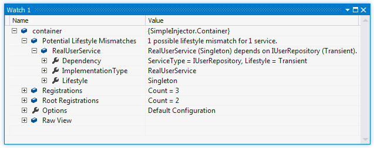
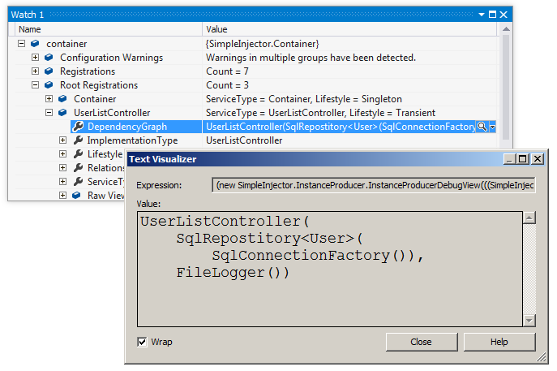

===================
Diagnostic Services
===================

The **Diagnostic Services** allow you to analyze the container's configuration to search for common configuration mistakes.

How to view diagnostic results
==============================

There are two ways to view the diagnostic results - results can be viewed visually during debugging in Visual Studio and programmatically by calling the Diagnostic API.

Diagnostic results are available during debugging in Visual Studio after calling *Container.Verify()*. Set a breakpoint after the line that calls **Verify()** and when the breakpoint breaks, hover over the *Container* instance with the mouse. The debugger context menu will appear for the *Container* variable which you can unfold to view the diagnostic results. This might look like this:

.. image:: images/diagnosticsdebuggerview.png 
   :alt: Diagnostics debugger view context menu

Another option is to add the **container** variable to the Visual Studio watch window by right clicking on the variable and selecting 'Add Watch' in the context menu:

The debugger views also allow visualizing your application's dependency graphs. This can give you a good view of what the end result of your DI configuration is. By drilling into the list of **Registrations** or **Root Registrations**, you can select the text visualizer (the magnifying glass icon) on the **DependencyGraph** property on any of the lister registrations:

   
This same information can be requested programmatically by using the Diagnostic API. The Diagnostic API is located in the **SimpleInjector.Diagnostics.dll**. This dll is part of the core NuGet package. Interacting with the Diagnostic API is especially useful for automated testing. The following is an example of an integration test that checks whether the container is free of configuration warnings:

.. code-block:: c#

    [TestMethod]
    public void Container_Always_ContainsNoDiagnosticWarnings() {
        // Arrange
        var container = Bootstrapper.GetInitializedContainer();

        container.Verify();

    	// Assert
        var results = Analyzer.Analyze(container);

        Assert.IsFalse(results.Any(), Environment.NewLine +
            string.Join(Environment.NewLine,
                from result in results
                select result.Description));
    }

Limitations
===========

.. container:: Note

    **Warning**: Although the *Container* can spot several configuration mistakes, be aware that there will always be ways to make configuration errors that the Diagnostic Services cannot identify. Wiring your dependencies is a delicate matter and should be done with care. Always follow best practices.

The **Diagnostic Services** work by analyzing all information that is known by the container. In general, only relationships between types that can be statically determined (such as analyzing constructor arguments) can be analyzed. The *Container* uses the following information for analysis:

* Constructor arguments of types that are created by the container (auto-wired types).
* Dependencies added by :ref:`Decorators`.
* Dependencies that are not registered explicitly but are referenced as constructor argument (this included types that got created through unregistered type resolution).

The Diagnostic Services **cannot** analyze the following:

* Types that are completely unknown, because these types are not registered explicitly and no registered type depends on them. In general you should register all root types (types that are requested directly by calling **GetInstance<T>()**, such as MVC Controllers) explicitly.
* Open-generic registrations that are resolved as root type (no registered type depends on them). Since the container uses unregistered type resolution, those registrations will be unknown untill they are resolved. Prefer registering each closed-generic version explicitly, or add unit tests to verify that these root types can be resolved.
* Dependencies added using the `RegisterInitializer <https://simpleinjector.org/ReferenceLibrary/?topic=html/M_SimpleInjector_Container_RegisterInitializer__1.htm>`_ method:

.. code-block:: c#

    container.RegisterInitializer<IService>(service => {
        // These dependencies will be unknown during diagnosis
        service.Dependency = new Dependency();
        service.TimeProvider = container.GetInstance<ITimeProvider>()
    });

* Types that are created manually by registering a *Func<T>* delegate using one of the `Register<TService>(Func<TService>) <https://simpleinjector.org/ReferenceLibrary/?topic=html/M_SimpleInjector_Container_Register__1_2.htm>`_ overloads, for instance:

.. code-block:: c#

    container.Register<IService>(() => new MyService(
        // These dependencies will be unknown during diagnosis
        container.GetInstance<ILogger>(),
        container.GetInstance<ITimeProvider>()));

* Any dependencies that are injected using the (now deprecated) `InjectProperties <https://simpleinjector.org/ReferenceLibrary/?topic=html/M_SimpleInjector_Container_InjectProperties.htm>`_ method will not be seen as dependencies of the type they are injected into.
* Dependencies that are resolved by requesting them manually from the *Container*, for instance by injecting the *Container* into a class and then calling *container.GetInstance<T>()* from within that class:

.. code-block:: c#

    public class MyService : IService {
        private ITimeProvider provider;
        
        // Type depends on the container (don't do this)
        public MyService(Container container) {
            // This dependency will be unknown during diagnosis
            this.provider = container.GetInstance<ITimeProvider>();
        }
    });

.. container:: Note

    **Tip**: Try to prevent depending on any framework features listed above because they all prevent you from having a :ref:`verifiable configuration <Verify-Configuration>` and trustworthy diagnostic results.

Supported Warnings
==================

.. toctree::
    :titlesonly:

    Potential Lifestyle Mismatches <PotentialLifestyleMismatches>
    Short Circuited Dependencies <ShortCircuitedDependencies>
    Potential Single Responsibility Violations <PotentialSingleResponsibilityViolations>
    Container-Registered Types <ContainerRegisteredTypes>
    Torn Lifestyle <tornlifestyle> 
    Disposable Transient Components <disposabletransientcomponent>