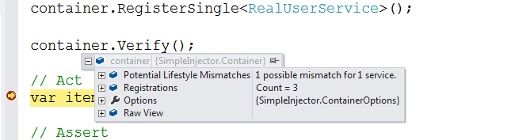

===========
Quick Start
===========

Overview
========

The goal of *Simple Injector* is to provide .NET application developers with an easy, flexible, and fast `Inversion of Control library <http://martinfowler.com/articles/injection.html>`_, that uses best practices to steer developers towards the pit of success.

Many of the existing IoC frameworks have a big complicated legacy API or are new, immature, and lack the features to be used in large developement projects. *Simple Injector* fills this gap by supplying a simple implementation with carefully chosen features in the core library. File and attribute based configuration methods have been abandoned (they invariably result in brittle and maintenance heavy applications), favoring simple code based configuration instead. This is enough for most applications, requiring only that the configuration be performed at the start of the program. The core library contains many features and allows almost any [advanced scenario|Advanced-scenarios].

The following platforms are supported:

* *.NET 4.0* and up.
* *Silverlight 4* and up.
* *Windows Phone 8*.
* *Windows Store Apps*.
* *Mono*.

*Simple Injector* is carefully designed to run in **partial / medium trust**, and it is fast; `blazingly fast <https://simpleinjector.codeplex.com/discussions/326621>`_.

New Diagnostic Services in Simple Injector 2
============================================

Simple Injector 2.0 adds the ability to warn about common misconfigurations while debugging the application. Many Simple Injector users have already used this feature to diagnose their configuration and have successfully fixed problems that would be very hard to find otherwise. Here's a quick example of how this might look in the debugger:

See the [Debug Diagnostic Services|Diagnostics] page for more information.

Getting started
===============

The easiest way to get started is by using  `the available NuGet packages <https://nuget.org/packages?q=simpleinjector&sortOrder=package-download-count>`_. If you're not a NuGet fan, follow the steps below, to start using *Simple Injector*:

# Go to the `Downloads <https://simpleinjector.codeplex.com/releases/>`_ tab and download the latest **runtime library**;
# Unpack the downloaded .zip file;
# Add the **SimpleInjector.dll** to your start-up project by right-clicking on a project in the Visual Studio solution explorer and selecting 'Add Reference...'.
# Add the **using SimpleInjector;** directive on the top of the code file where you wish to configure the application.
# Look at the [Usage|Using the Simple Injector] section in the documentation on how to configure and use the *Simple Injector*.
# Look at the [More information|#More**information] section if you want to learn more or have any questions.

A Quick Example
===============

The general idea behind the *Simple Injector* (or any DI framework for that matter) is that you design your application around loosely coupled components using the `dependency injection pattern <https://en.wikipedia.org/wiki/Dependency**injection>`_. Take for instance the following **UserController** class in the context of an ASP.NET MVC application:

.. container:: Note

    **Note:** *Simple Injector* works for many different technologies, not only for MVC. Please look at the [Integration Guide] for help using the *Simple Injector* with your technology of choice.

.. code-block:: c#

    public class UserController : Controller {
        private readonly IUserRepository repository;
        private readonly ILogger logger;

        // Use constructor injection for the dependencies
        public UserController(IUserRepository repository, ILogger logger) {
            this.repository = repository;
            this.logger = logger;
        }

        // implement UserController methods here:
        public ActionResult Index() {
            this.logger.Log("Index called");
            return View(this.repository.GetAll());
        }
    }

The **UserController** class depends on the **IUserRepository** and **ILogger** interfaces. By not depending on concrete implementations, we can test **UserController** in isolation. Ease of testing is however, just the start of what Dependency Injection will accomplish. It allows us to design highly flexible systems that can completely be composed at a single place (often the startup path) in the application.

Using *Simple Injector*, the configuration of the application using the **UserController** class, could look as follows:

.. code-block:: csharp

    protected void Application_Start(object sender, EventArgs e) {
        // 1. Create a new Simple Injector container
        var container = new Container();

        // 2. Configure the container (register)
        container.Register<IUserRepository, SqlUserRepository>();

        container.RegisterSingle<ILogger>(() => new CompositeLogger(
            container.GetInstance<DatabaseLogger>(),
            container.GetInstance<MailLogger>()
        ));

        ; // 3. Optionally verify the container's configuration.
        container.Verify();

        // 4. Register the container as MVC3 IDependencyResolver.
        DependencyResolver.SetResolver(new SimpleInjectorDependencyResolver(container));
    }

.. container:: Note

    **Tip**: If you start with a MVC application, use the `NuGet Simple Injector MVC Integration Quick Start package <https://nuget.org/packages/SimpleInjector.MVC3>`_.

The given configuration registers implementations for the **IUserRepository** and **ILogger** interfaces. The code snippet shows a few interesting things. First of all, you can map concrete instances (such as **SqlUserRepository**) to an interface or base type. In the given example, every time you ask the container for an **IUserRepository**, it will create a new **SqlUserRepository** on your behalf (in DI terminology: an object with a **Transient** lifestyle).

The registration of the **ILogger** is a bit more complex though. It registers a delegate that knows how to create a new **ILogger** implementation, in this case **CompositeLogger** (which is an implementation of **ILogger**). The delegate itself calls back into the container and this allows the container to create the concrete **DatabaseLogger** and **MailLogger** and inject them into the **CompositeLogger**. While the type of registration that we’ve seen with the **IUserRepository** is much more common, the use of delegates allows many interesting scenarios.

.. container:: Note

    **Note**: We did not register the **UserController**, because the **UserController** is a concrete type, *Simple Injector* can implicitly create it (as long as its dependencies can be resolved).

This is in fact all it takes to start using the *Simple Injector*. Design your classes around the dependency injection principle (which is actually the hard part) and configure them in the top of your application. Some frameworks (such as ASP.NET MVC) will do the rest for you. Other frameworks (like ASP.NET Web Forms) will need a little bit more work to get this done. See the [Integration Guide] for examples of your framework of choice.

.. container:: Note

    Please go to the [Using the Simple Injector] section in the documentation to see more examples.

More information
================

For more information about *Simple Injector* please visit the following links: 

* [Using the Simple Injector] will guide you through the *Simple Injector* basics.
* The [Simple Injector and object lifetime management|ObjectLifestyleManagement] page explains how to configure lifestyles such as **transient**, **singleton**, and many others.
* See the `Reference library <https://simpleinjector.org/ReferenceLibrary/>`_ for the complete API documentation.
* See the [Integration Guide] for more information about how to integrate *Simple Injector* into your specific application framework.
* For more information about **dependency injection** in general, please visit `this page on Stackoverflow <https://stackoverflow.com/tags/dependency-injection/info>`_.
* If you have any questions about how to use *Simple Injector* or about **dependency injection** in general, the experts at `Stackoverflow.com <http://stackoverflow.com/questions/ask?tags=simple-injector%20ioc-container%20dependency-injection%20.net%20c%23&title=Simple%20Injector>`_ are waiting for you.
* For all other *Simple Injector* related question and discussions, such as bug reports and feature requests, the `Simple Injector discussion forum <https://simpleinjector.codeplex.com/discussions>`_ will be the place to start.

Happy injecting!