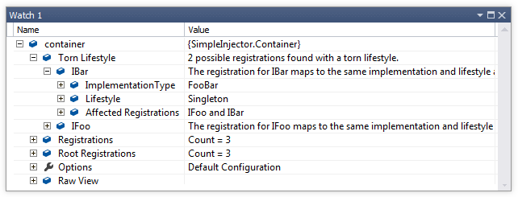

===================================
Diagnostic Warning - Torn Lifestyle
===================================

Cause
=====

Multiple registrations with the same lifestyle map to the same component.

Warning Description
===================

When multiple registrations with the same lifestyle map to the same component, this component is said to have a torn lifestyle. The component is known to be torn, because each registration will get its own instance of the given component, which might result in multiple instances of that component within a certain scope.

When a component is torn, the application might be wired incorrectly because the flagged component gets multiple instances in a certain scope. This can result in unexpected behavior.

How to Fix Violations
=====================

Create a Registration instance for that component using Lifestyle.CreateRegistration and use that for both registrations.

When to Ignore Warnings
=======================

This warning can safely be ignored your intention is to have multiple instances of the flagged component within such scope.

Example
=======

The following example shows a configuration that will trigger the warning:

.. code-block:: c#

    var container = new Container();

    container.Register<IFoo, FooBar>(Lifestyle.Singleton);
    container.Register<IBar, FooBar>(Lifestyle.Singleton);

    container.Verify();

The *FooBar* component is registered as **Singleton** twice; once for **IFoo** and once for **IBar**. Below is an image that shows the output for this configuration in a watch window. The watch window shows two mismatches and one of the warnings is unfolded.

The issue can be fixed as follows:

.. code-block:: c#

    var container = new Container();

    var registration = Lifestyle.Singleton.CreateRegistration<FooBar>(container);
    
    container.AddRegistration(typeof(IFoo), registration);
    container.AddRegistration(typeof(IBar), registration);
    
    container.Verify();
   
The following example shows how to query the Diagnostic API for Torn Lifestyles:

.. code-block:: c#

    // using SimpleInjector.Diagnostics;

    var container = /* get verified container */;

    var results = Analyzer.Analyze(container).OfType<TornLifestyleDiagnosticResult>();
        
    foreach (var result in results) {
        Console.WriteLine(result.Description);
        Console.WriteLine("Component name: " + result.ImplementationType.Name);
        Console.WriteLine("Lifestyle of component: " + result.Lifestyle.Name);
        Console.WriteLine("Affected registrations: " +
            string.Join(", ", result.AffectedRegistrations.Select(r => r.ServiceType.Name)));
    }

