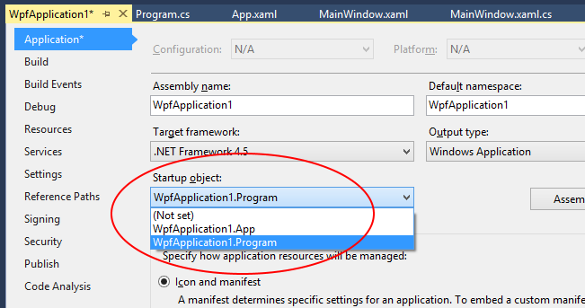

=================================================
Windows Presentation Foundation Integration Guide
=================================================

Simple Injector can build up *Window* classes with their dependencies. Use the following steps as a how-to guide:

Step 1:
-------

Change the App.xaml markup by removing the *StartUri* property:

.. code-block:: xml

    <Application x:Class="SimpleInjectorWPF.App"
                 xmlns="http://schemas.microsoft.com/winfx/2006/xaml/presentation"
                 xmlns:x="http://schemas.microsoft.com/winfx/2006/xaml">
        <!-- Remove the StartupUri property, start the application from a static Main -->
        <Application.Resources>
        </Application.Resources>
    </Application>
    
Step 2:
-------

Add a *Program.cs* file to your project to be the new entry point for the application:

.. code-block:: c#

    using System;
    using System.Windows;
    using SimpleInjector;

    static class Program
    {
        [STAThread]
        static void Main()
        {
            var container = Bootstrap();

            // Any additional other configuration, e.g. of your desired MVVM toolkit.

            RunApplication(container);
        }

        private static Container Bootstrap()
        {
            // Create the container as usual.
            var container = new Container();

            // Register your types, for instance:
            container.Register<IQueryProcessor, QueryProcessor>(Lifestyle.Singleton);
            container.Register<IUserContext, WpfUserContext>();

            // Register your windows and view models:
            container.Register<MainWindow>();
            container.Register<MainWindowViewModel>();

            container.Verify();

            return container;
        }

        private static void RunApplication(Container container)
        {
            try
            {
                var app = new App();
                var mainWindow = container.GetInstance<MainWindow>();
                app.Run(mainWindow);
            }
            catch (Exception ex)
            {
                //Log the exception and exit
            }
        }
    }

Step 3:
-------

Change the 'Startup object' in the properties of your project to be the newly created *Program* class:

Usage
-----

Constructor injection can now be used in any window (e.g. *MainWindow*) and view model:

.. code-block:: c#

    using System.Windows;

    public partial class MainWindow : Window
    {
        public MainWindow(MainWindowViewModel viewModel)
        {
            InitializeComponent();

            // Assign to the data context so binding can be used.
            base.DataContext = viewModel;
        }
    }

    public class MainWindowViewModel
    {
        private readonly IQueryProcessor queryProcessor;
        private readonly IUserContext userContext;

        public MainWindowViewModel(
            IQueryProcessor queryProcessor, IUserContext userContext)
        {
            this.queryProcessor = queryProcessor;
            this.userContext = userContext;
        }

        public IEnumerable<IUser> Users => this.queryProcessor.Execute(new GetAllUsers());
    }
